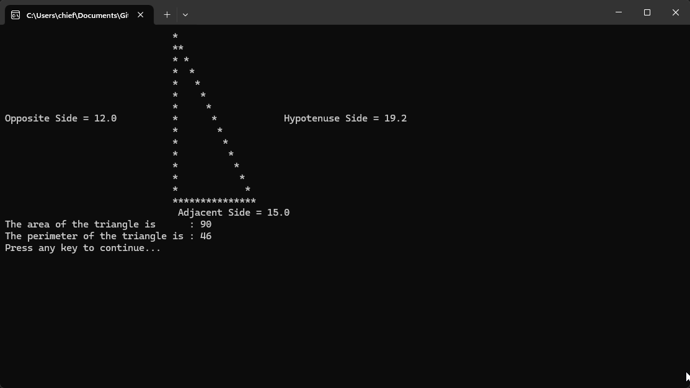

# Triangle Calculator

A simple Windows console-based program written in C++ that calculates and displays right triangles using basic trigonometric relationships. It lets users define the **opposite** and **adjacent** sides, then dynamically renders the triangle in the console.

## Features
    Easy-to-use console interface,
    Customizable triangle dimensions,
    Neatly formatted triangle shape display,
    Supports floating-point values for side lengths,
    Error handling for display alignment (minor shifting on extreme values),
    Built-in pause (_getch) for user input between triangle displays.

## How to Run

Using an IDE (e.g., Visual Studio, CLion, Code::Blocks):

    Just simply open the Triangle Calculator.sln and run with debugging in your IDE of choice 

> ⚠️ Note: This program uses `#pragma warning (disable:6031)` and `<conio.h>` for `_getch()` — it is designed to run on **Windows only**.

## Demo Output

